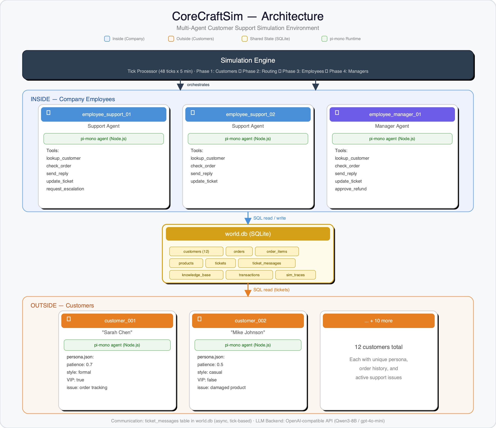
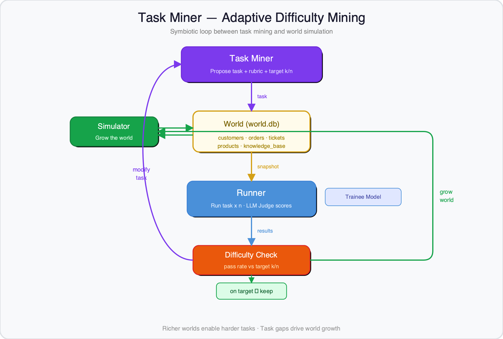

# CoreCraftSim

## Why?

The bottleneck for RL-trained LLMs isn't algorithms — it's environments. We have GRPO, we have compute, but we don't have a scalable way to create the diverse, realistic environments needed to train agents.

Research areas like **Unsupervised Environment Design (UED)** and **Open-endedness** point toward solutions, but there's a gap between theory and practice. CoreCraftSim is an experiment exploring one concrete approach: **what if you could grow RL environments from simulated worlds instead of hand-crafting them?**

## Enter Simulators

This work is inspired by [Generative Agents: Interactive Simulacra of Human Behavior](https://arxiv.org/abs/2304.03442) — the idea that LLM-powered agents can simulate believable human behavior in rich, persistent worlds. We apply this to enterprise environments: instead of a small town, we simulate a company with customers, support agents, and managers.

## Enter CoreCraftSim

A Smallville-style multi-agent simulation where LLM-powered customers, support agents, and managers interact through a shared database. This produces organic, realistic scenarios — not scripted ones.

```
Simulate World → Mine Tasks → Train Agents
```



The simulation runs on a tick-based engine (48 ticks x 5 min) with 4 phases per tick:
1. **Customers** generate messages based on their persona and situation
2. **Routing** assigns tickets to available agents
3. **Employees** respond using tools (lookup_customer, check_order, send_reply, update_ticket)
4. **Managers** handle escalations and approve refunds

Each agent runs in its own Docker container with a pi-mono (Node.js) runtime, communicating asynchronously through `ticket_messages` in a shared SQLite database (`world.db`).

## Showcase

### Task Miner

The Task Miner and Simulator form a **symbiotic loop**: the miner proposes tasks from the world state, evaluates them against a trainee model n times to assess difficulty (targeting a k/n fail rate), then either adjusts the task or grows the world via the simulator to enable harder tasks.



### Example Task Mined

Each mined task is a self-contained RL scenario with a rubric for LLM-judge evaluation:

```json
{
  "id": "task_004_damaged_product",
  "category": "multi_step",
  "difficulty": "hard",
  "system_prompt": "You are a Customer Support Representative at an office furniture company...",
  "user_message": "New ticket from Sarah Chen (customer_001):\n\n\"Hi — I bought the ErgoDesk Pro (order ord_001) and found a large scratch across the entire desktop...\"",
  "tools": ["lookup_customer", "check_order", "send_reply", "update_ticket", "request_escalation"],
  "rubric": [
    {"criterion": "Looked up customer_001 and noted multiple previous tickets", "type": "tool_use", "weight": 0.1},
    {"criterion": "Checked order and correctly identified ErgoDesk Pro at $549.99", "type": "correctness", "weight": 0.15},
    {"criterion": "Referenced Damaged Item Policy — free replacement or full refund", "type": "constraint", "weight": 0.15},
    {"criterion": "Escalated because value exceeds $200 agent limit", "type": "constraint", "weight": 0.2},
    {"criterion": "Sent professional reply acknowledging scratch and requesting photos", "type": "tool_use", "weight": 0.15},
    {"criterion": "Provides concrete resolution options with realistic timelines", "type": "format", "weight": 0.15}
  ]
}
```

### Training

We wrapped the mined tasks as an OpenEnv RL environment and trained Qwen3-8B with GRPO (189 examples, 1 epoch, LoRA r=16) on an H100 GPU. Results after just 1 epoch:


Key improvements:
- **Resolution rate doubled**: 12.5% → 25% (1/8 → 2/8 tasks solved)
- **Average reward +21%**: 0.322 → 0.389
- **Steps reduced**: 9.0 → 7.9 (more efficient tool use)
- **Standout — Task 004 (Damaged Product)**: reward jumped from 0.105 → 0.700 (+567%). The trained model learned to lookup the customer first, check the order, then escalate — matching the expected workflow.

**Reward** = `0.55 × resolution + 0.30 × satisfaction + 0.15 × efficiency`

## Project Structure

```
src/enterprise_sim/          # World simulation engine
├── orchestrator/            # Tick-based simulation loop, agent management
├── agents/                  # LLM-powered agent definitions
├── tools/                   # CLI tools for agents to interact with the world
├── task_miner/              # Extract RL tasks from simulation data
└── analyze/                 # Simulation analysis and reporting

openenv_pkg/                 # OpenEnv RL environment (deployable to HF Spaces)
├── server/                  # FastAPI environment server
│   ├── environment.py       # MCPEnvironment with reward computation
│   ├── customer_agent.py    # LLM-simulated customer for training
│   └── tools.py             # DB-backed tool functions
├── client.py                # Python client for programmatic interaction
└── data/                    # World DB, agent personas, mined tasks

dashboard/                   # Web dashboard for simulation analysis
```

## Quick Start

### Run the world simulation

```bash
uv run enterprise-sim simulate --num-ticks 50 --output output/
```

### Mine tasks from the simulated world

```bash
uv run enterprise-sim mine-tasks --db output/world.db
```

### Deploy the RL environment

```bash
cd openenv_pkg
uv run openenv push --repo-id <your-hf-repo>
```

### Train an agent

```python
from client import CustomerSupportEnv

env = CustomerSupportEnv(base_url="https://your-space.hf.space")
with env:
    obs = env.reset()
    print(obs.customer_message)

    obs = env.call_tool("lookup_customer", customer_id=obs.customer_id)
    obs = env.call_tool("send_reply", ticket_id=obs.ticket_id, message="Let me help you with that.")
    print(f"Satisfaction: {obs.satisfaction}, Resolved: {obs.resolved}")
```

## The Environment

The customer support environment exposes 4 tools:

| Tool | Description |
|------|-------------|
| `lookup_customer` | Look up customer profile, order history, open tickets |
| `check_order` | Get full order details, items, shipping status |
| `send_reply` | Reply to the customer (triggers LLM customer response) |
| `update_ticket` | Update ticket status, add internal notes |

Each episode runs up to 10 steps. The simulated customer responds with realistic messages and satisfaction signals based on their persona (patience level, communication style, issue complexity).

## Live Demo

Try the interactive environment: [HuggingFace Space](https://huggingface.co/spaces/jjmachan/enterprise-sim-support)
